<div align="center">

<br />

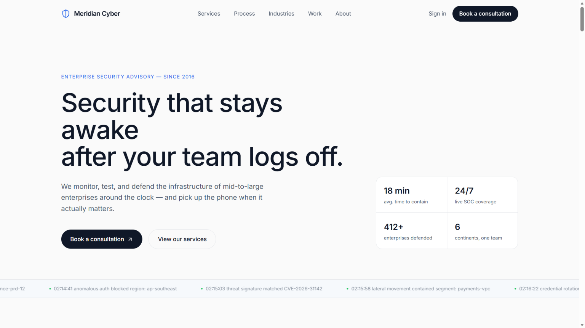

<br />
<br />

# Meridian Cyber

**A modern enterprise cybersecurity website — original branding, editorial design, and smooth animations**

<p>
  <a href="https://meridian-cyber.vercel.app">
    
  </a>
  &nbsp;
  <a href="https://github.com/PriyankaChoudhary9877/meridian-cyber">
    
  </a>
</p>

<p>
  
  
  
  
  
  
  
</p>

</div>

---

## Overview

Meridian Cyber is a modern enterprise cybersecurity website built using React, TypeScript, and Vite. The project was created as an original redesign concept inspired by enterprise cybersecurity platforms such as D360 Secure while maintaining its own branding, layout, and content.

The website focuses on modern UI/UX, responsive layouts, reusable React components, smooth animations, and clean frontend architecture. It demonstrates how a professional cybersecurity company's online presence can be built using current frontend technologies.

---

## Screenshots

<table>
  <tr>
    <td align="center" width="50%">
      <b>Hero Section</b><br /><br />
      
    </td>
    <td align="center" width="50%">
      <b>Services Section</b><br /><br />
      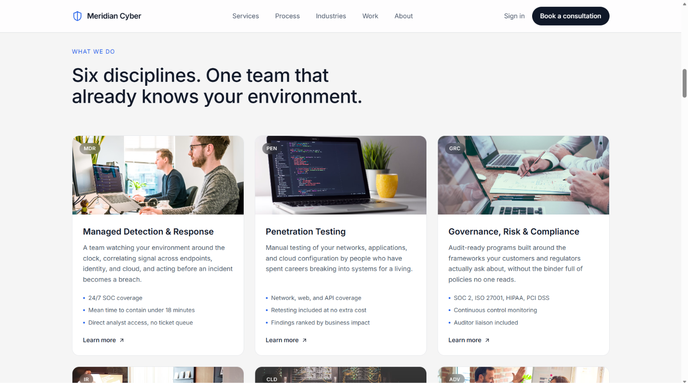
    </td>
  </tr>
  <tr>
    <td align="center" width="50%">
      <b>Why Choose Us</b><br /><br />
      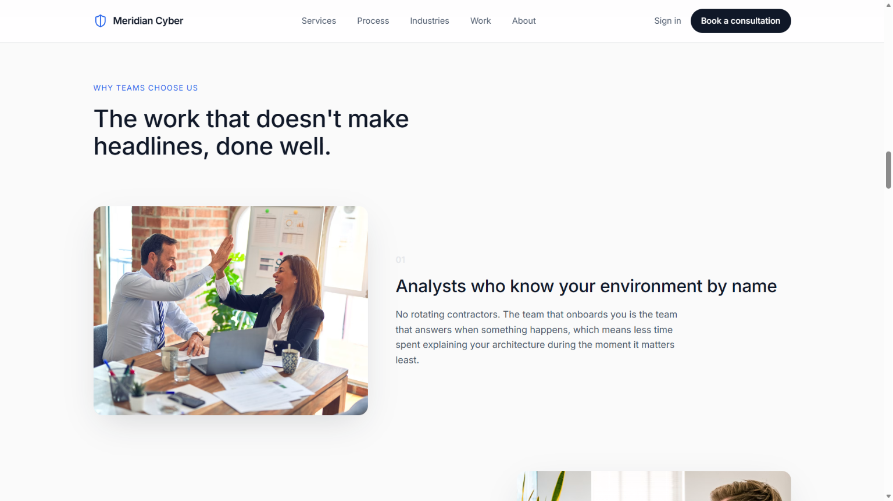
    </td>
    <td align="center" width="50%">
      <b>Process Section</b><br /><br />
      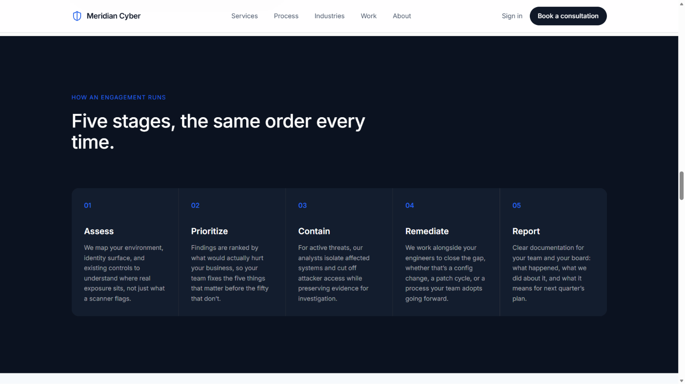
    </td>
  </tr>
</table>

<details>
<summary><b>More Screenshots</b></summary>

<br />

**More Services**

<p align="center">
  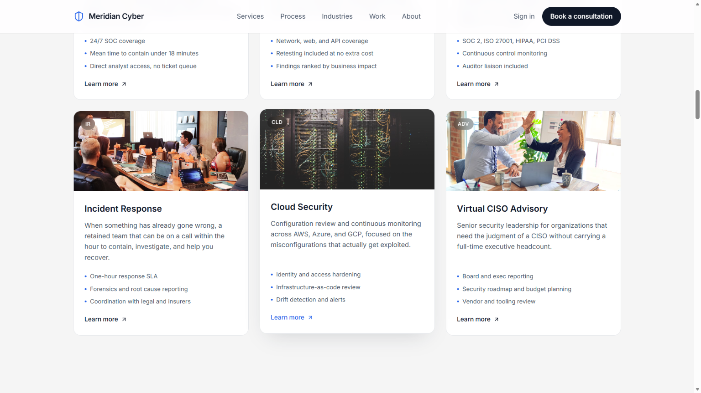
</p>

**Why Choose Us — Extended**

<p align="center">
  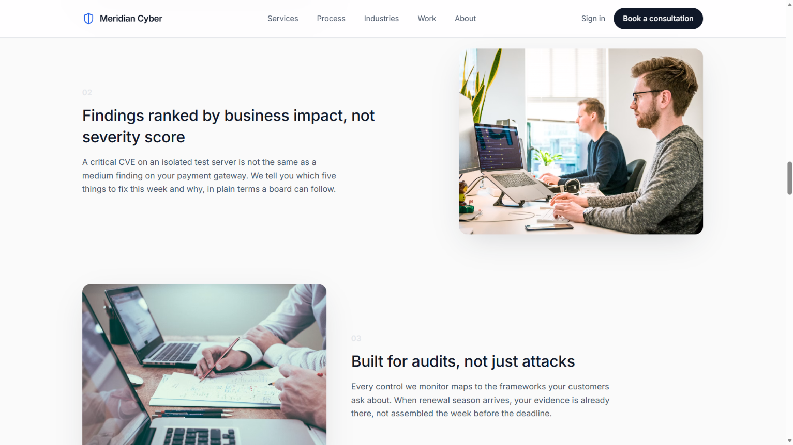
</p>

**Industries Section**

<p align="center">
  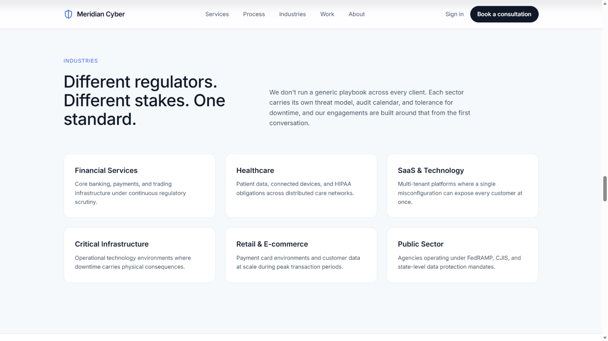
</p>

**Testimonials**

<p align="center">
  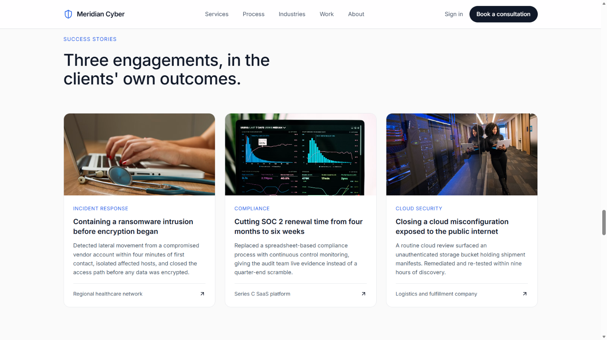
</p>

**Blog / Insights Preview**

<p align="center">
  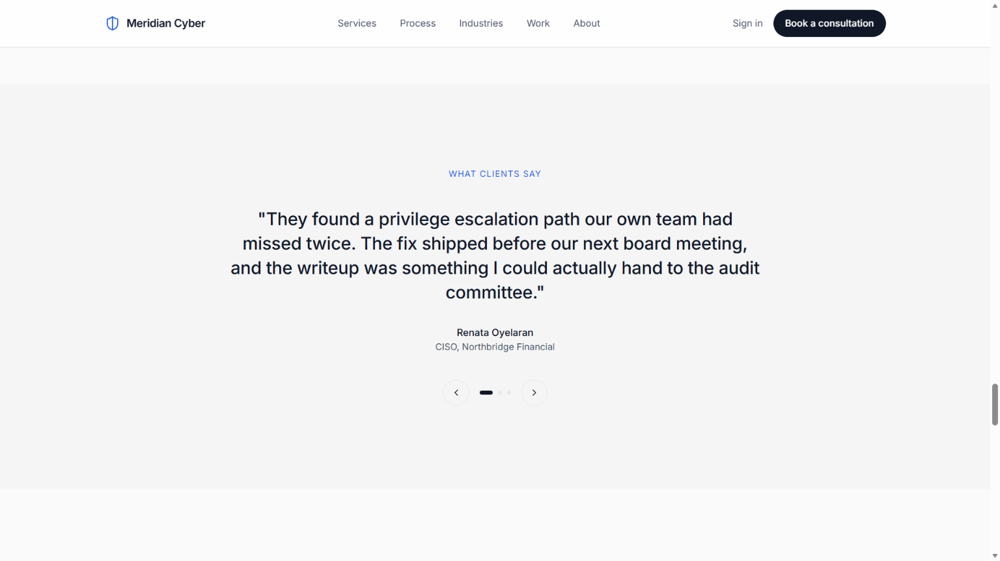
</p>

**FAQ Section**

<table align="center">
  <tr>
    <td align="center"><b>FAQ</b><br /><br />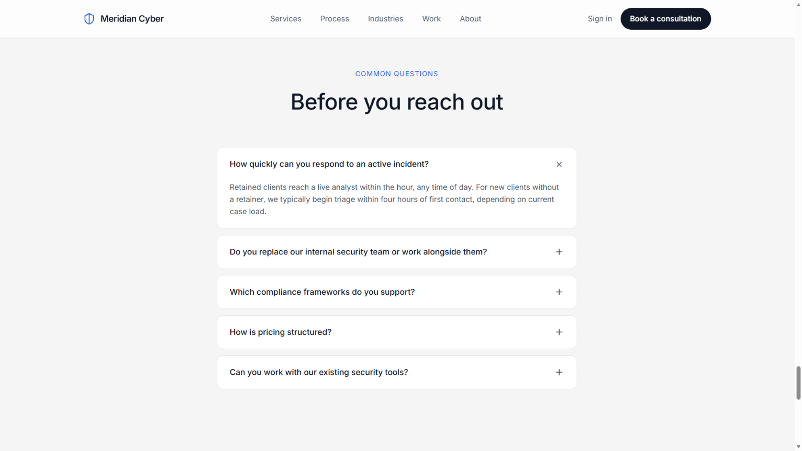</td>
    <td align="center"><b>FAQ Section</b><br /><br />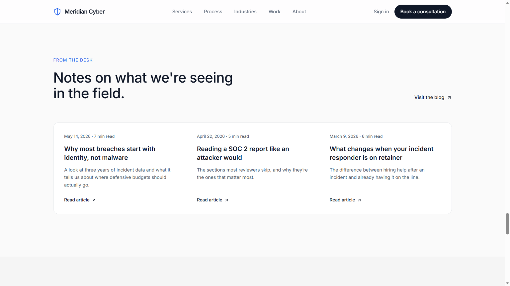</td>
  </tr>
</table>

<br />

**Call to Action**

<p align="center">
  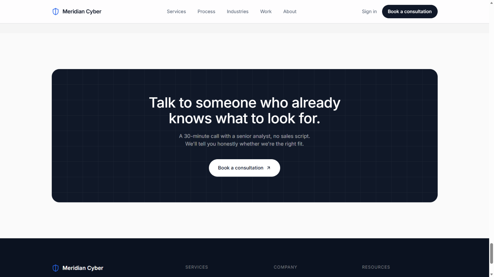
</p>

**Contact Section**

<p align="center">
  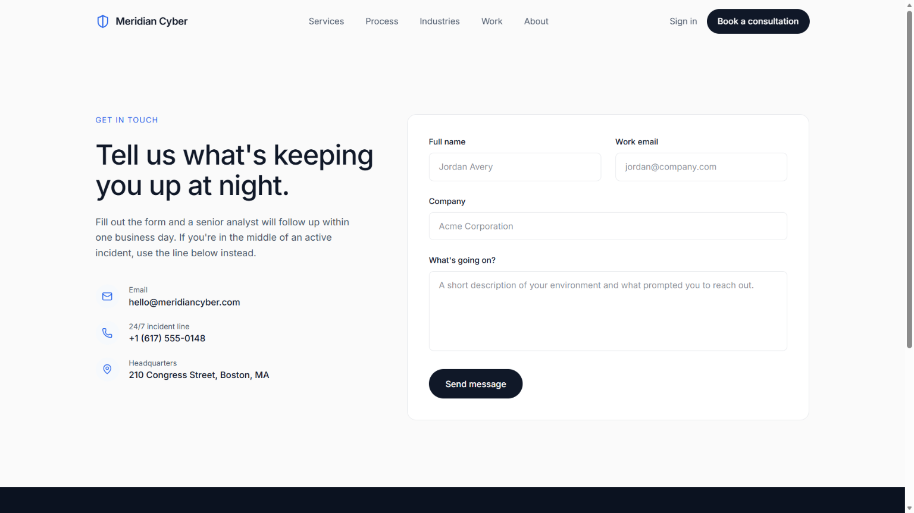
</p>

**Footer**

<p align="center">
  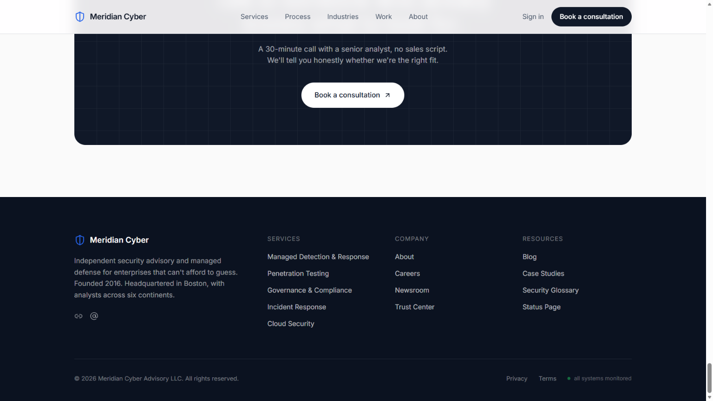
</p>

</details>

---

## Features

| Feature | Description |
|---|---|
| Interactive Hero Section | Professional hero section with animated highlights, cybersecurity branding, and primary call-to-action. |
| Services Grid | Six service cards with photography, code labels, and hover lift animations |
| Alternating Why Choose Us Rows | Three editorial image-and-text rows with scroll-reveal on entry |
| Security Process Timeline | A five-stage horizontal grid on a dark background — Assess, Prioritize, Contain, Remediate, Report |
| Industries Section | Six sector cards covering Financial Services, Healthcare, SaaS, Critical Infrastructure, Retail, and Public Sector |
| Case Studies | Three editorial cards with real photography, category tags, and hover interactions |
| Testimonial Carousel | Animated quote slider with Framer Motion transitions and accessible navigation |
| Blog Preview Strip | Three-column article preview grid with date and read-time metadata |
| FAQ Accordion | Smooth expand/collapse FAQ built with AnimatePresence for zero-layout-shift animations |
| CTA Banner | Subtle grid-textured dark banner with a strong, human-written call to action |
| Contact Form | Fully validated form with error states, loading state, and a success confirmation view |
| Sticky Navbar | Scroll-aware navbar with backdrop blur, mobile hamburger menu, and anchor-link smooth scroll |
| Footer | Dark navy footer with column links, social icons, and an animated "all systems monitored" status badge |
| 404 Page | On-brand not-found page with a dry, confident message |
| Scroll Reveal Animations | Fade and slide-up reveals on viewport entry via a shared `Reveal` wrapper component |
| Fully Responsive | Layout adapts cleanly across desktop, laptop, tablet, and mobile |
| Accessible | Focus rings, ARIA labels, `prefers-reduced-motion` support, semantic HTML |

---

## Tech Stack

<table>
  <tr>
    <td valign="top" width="25%">
      <b>Frontend</b><br /><br />
      <br />
      <br />
      <br />
      
    </td>
    <td valign="top" width="25%">
      <b>Animation</b><br /><br />
      
    </td>
    <td valign="top" width="25%">
      <b>Routing</b><br /><br />
      
    </td>
    <td valign="top" width="25%">
      <b>Deployment</b><br /><br />
      
    </td>
  </tr>
</table>

---

## Getting Started

<details>
<summary><b>Prerequisites</b></summary>

<br />

- Node.js `v18+`
- npm `v9+`

No API keys or external services required. All project assets and screenshots are included within the repository.

</details>

<details open>
<summary><b>Installation</b></summary>

<br />

**1. Clone the repository**

```bash
git clone https://github.com/PriyankaChoudhary9877/meridian-cyber.git
cd meridian-cyber
```

**2. Install dependencies**

```bash
npm install
```

**3. Start the development server**

```bash
npm run dev
```

The site will be available at `http://localhost:5173`.

</details>

<details>
<summary><b>Build for Production</b></summary>

<br />

```bash
npm run build
```

Output is written to the `dist/` directory. To preview the production build locally:

```bash
npm run preview
```

</details>

---

## Project Structure

```
meridian-cyber/
│
├── public/                        # Static assets and favicon
│   └── shield.svg
│
├── src/
│   ├── components/
│   │   ├── layout/
│   │   │   ├── Navbar.tsx         # Sticky nav with mobile menu and scroll-aware styling
│   │   │   └── Footer.tsx         # Dark footer with column links and status indicator
│   │   ├── sections/
│   │   │   ├── Hero.tsx           # Hero section with call-to-action and key highlights
│   │   │   ├── TrustedBy.tsx      # Client trust and partner showcase
│   │   │   ├── About.tsx          # Image + text editorial row
│   │   │   ├── Services.tsx       # Six-card service grid
│   │   │   ├── WhyChooseUs.tsx    # Alternating image/text reasons
│   │   │   ├── Process.tsx        # Five-stage process timeline (dark)
│   │   │   ├── Industries.tsx     # Industry sector cards
│   │   │   ├── Statistics.tsx     # Statistics and key metrics section
│   │   │   ├── CaseStudies.tsx    # Three case study cards
│   │   │   ├── Testimonials.tsx   # Animated testimonial carousel
│   │   │   ├── BlogPreview.tsx    # Three-column blog post preview
│   │   │   ├── FAQ.tsx            # Accordion FAQ
│   │   │   ├── CTABanner.tsx      # Dark consultation CTA
│   │   │   └── ContactForm.tsx    # Contact form with validation and submission feedback
│   │   └── ui/
│   │       ├── Reveal.tsx         # Reusable scroll-reveal wrapper (Framer Motion)
│   │       └── Counter.tsx        # Animated number counter on viewport entry
│   │
│   ├── data/
│   │   └── content.ts             # All site copy, structured data, and configuration
│   │
│   ├── hooks/
│   │   └── useReveal.ts           # Shared useInView hook for scroll animations
│   │
│   ├── pages/
│   │   ├── Home.tsx               # Homepage — assembles all sections
│   │   ├── AboutPage.tsx          # About page with company overview and mission.
│   │   ├── ContactPage.tsx        # Contact page with form and office details
│   │   └── NotFound.tsx           # 404 page
│   │
│   ├── App.tsx                    # Root component with router and layout
│   ├── main.tsx                   # React entry point
│   └── index.css                  # Global styles and Tailwind v4 design tokens
│
├── index.html
├── vite.config.ts
├── tsconfig.json
└── package.json
```

---

## Future Improvements

- Dark mode toggle
- CMS-powered blog with full article pages
- Backend contact form with email delivery
- Multi-language support
- Client portal with authentication
- Analytics dashboard for site performance tracking

---

## Author

<table>
  <tr>
    <td align="center">
      <b>Priyanka Choudhary</b><br />
      Computer Science Engineering Student<br /><br />
      <a href="https://github.com/PriyankaChoudhary9877">
        
      </a>
      &nbsp;
      <a href="https://www.linkedin.com/in/priyanka-choudhary-58b048312/">
        
      </a>
      &nbsp;
      <a href="https://meridian-cyber.vercel.app">
        
      </a>
      &nbsp;
      <a href="mailto:priyankachoudhary9877@gmail.com">
        
      </a>
    </td>
  </tr>
</table>

---

<div align="center">

If you found this project useful, consider giving it a ⭐ on GitHub.

<br />

Designed and developed by Priyanka Choudhary.

</div>
